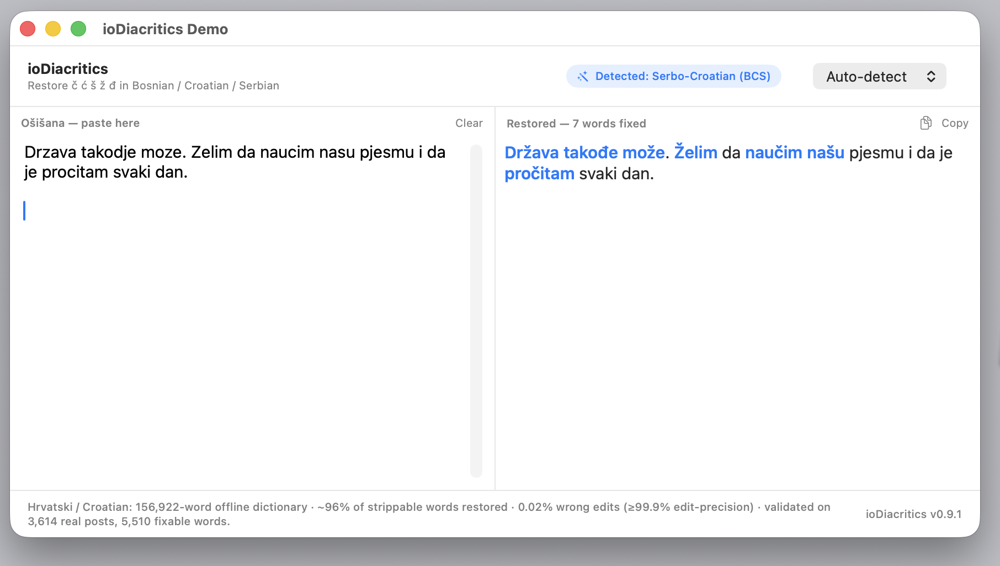

# ioDiacritics Demos

Showcase apps for the [`ioDiacritics`](https://github.com/ilya000/ioDiacritics) library —
restore stripped Bosnian / Croatian / Serbian Latin diacritics (`č ć š ž đ`) in **ošišana**
text:

```
Drzava takodje moze.   ->   Država takođe može.
nasa drzava            ->   naša država
```



## Download & run (no build needed)

Don't want to build it? Grab the ready-made **signed & notarized** macOS app:

➡️ **[Download ioDiacriticsDemo.dmg](https://github.com/ilya000/ioDiacritics-Demos/releases/latest/download/ioDiacriticsDemo.dmg)** — ~5.8 MB, macOS 13+

Open the DMG, drag **ioDiacritics Demo** into Applications, launch it. It's signed with a
Developer ID and notarized by Apple, so it opens on any Mac with no Gatekeeper warnings — just
double-click. The cross-platform C++ build is built from source (see below).

Each demo lives in its own subfolder, named **`Language-Platform(s)`**, and is a complete,
self-contained project. They share the same idea: paste/type ošišana text, restore it,
highlight what changed, copy with one button, auto-detect or pick the language.

## Demo Versions

| Demo version | Language / binding | Platforms | UI stack | Source |
|---|---|---|---|---|
| Swift desktop demo | Swift / SwiftPM | macOS | SwiftUI native window | [`Swift-macOS`](https://github.com/ilya000/ioDiacritics-Demos/tree/main/Swift-macOS) |
| C++ cross-platform demo | C++17 / CMake | Windows, macOS, Linux | Dear ImGui + GLFW + OpenGL3 | [`Cpp-Windows-macOS-Linux`](https://github.com/ilya000/ioDiacritics-Demos/tree/main/Cpp-Windows-macOS-Linux) |

Repository links:

- Main library: [`ilya000/ioDiacritics`](https://github.com/ilya000/ioDiacritics)
- All demos: [`ilya000/ioDiacritics-Demos`](https://github.com/ilya000/ioDiacritics-Demos)
- Swift/macOS demo: [`Swift-macOS`](https://github.com/ilya000/ioDiacritics-Demos/tree/main/Swift-macOS)
- C++ Windows/macOS/Linux demo: [`Cpp-Windows-macOS-Linux`](https://github.com/ilya000/ioDiacritics-Demos/tree/main/Cpp-Windows-macOS-Linux)

Both link the **same** library — the Swift demo via SwiftPM, the C++ demo via the library's
own C++17 port — so the engine, dictionaries, and quality numbers are identical. Both load the
full dictionaries (the invariant word set included) for maximum quality, and both report
**"Serbo-Croatian (BCS)"** when the variety genuinely can't be told apart from the text.

## Repository layout

```
ioDiacritics-Demos/
├── Swift-macOS/                 # SwiftUI demo (swift build / build_app.sh)
└── Cpp-Windows-macOS-Linux/     # Dear ImGui demo (CMake + FetchContent)
```

The demos depend on the `ioDiacritics` library checked out next to this folder
(`../ioDiacritics`). See each subfolder's `README.md` for build & run instructions.

## Adding another demo

Create a new `Language-Platform(s)` subfolder (e.g. `Kotlin-Android`, `Rust-CrossPlatform`,
`TypeScript-Web`), depend on the appropriate binding/port of `ioDiacritics`, and add a row to
the table above.

## License

Demo source code is licensed under the **MIT License** — see [LICENSE](LICENSE).

The demos themselves bundle no dictionaries and vendor no libraries. Anything you
**distribute** (a built `.app` or binary) additionally includes the ioDiacritics dictionaries
(separate data provenance) and, for the C++ demo, Dear ImGui (MIT), GLFW (zlib/libpng) and the
Roboto font (Apache-2.0). See [NOTICE.md](NOTICE.md) before shipping a public binary.
